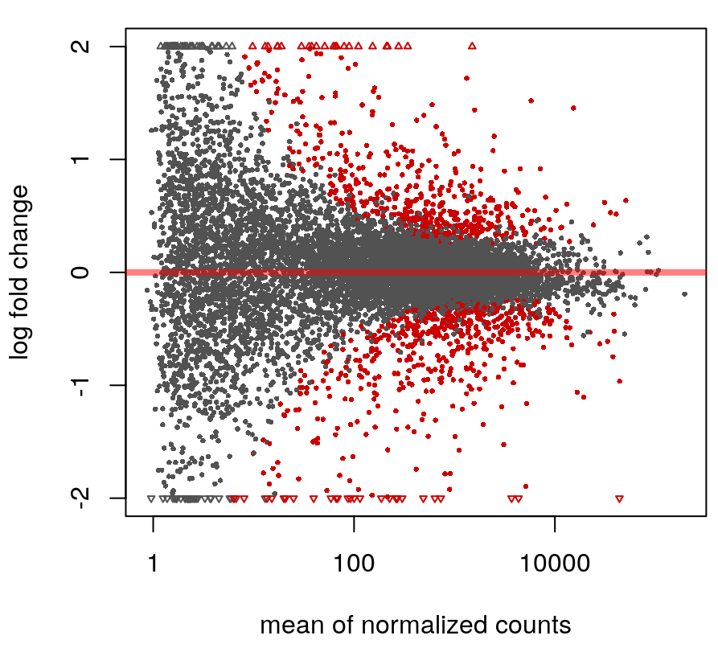
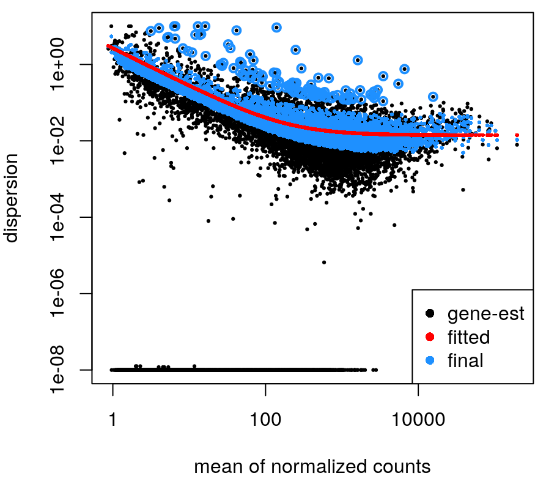

# Output description for rnaseq-nf pipeline
**rnaseq-nf** is a bioinformatics best-practice analysis pipeline used for RNA-seq data. The pipeline is focused in counts and differential expression analyses.

## Pipeline overview
The pipeline is built using [Nextflow](https://www.nextflow.io/) and processes data using the following steps:

* [FastQC](#fastqc) v0.11.8 - read quality control
* [Trimmomatic](#trimming) v.0.38 - adapter and low quality trimming.
* [STAR](#star) v2.6.1d - alignment
* [RSeQC](#rseqc) v3.0.0 - RNA quality control metrics
  * [BAM stat](#bam-stat)
  * [Clipping Profile](#clipping_profile)
  * [Infer experiment](#infer-experiment)
  * [Junction saturation](#junction-saturation)
  * [RPKM saturation](#rpkm-saturation)
  * [Read duplication](#read-duplication)
  * [Inner distance](#inner-distance)
  * [Gene body coverage](#gene-body-coverage)
  * [Read distribution](#read-distribution)
  * [Junction annotation](#junction-annotation)
* [Preseq](#preseq) v2.0.3 - library complexity
* [Picard](#picard) v2.18.27 - Identify duplicate reads
* [dupRadar](#dupradar) v1.12.1 - technical / biological read duplication
* [Subread](#featurecounts) v1.6.4 - gene counts, biotype counts, rRNA estimation.
* [StringTie](#stringtie) v1.3.5 - FPKMs for genes and transcripts
* [edgeR](#edger) v3.24.1 - create MDS plot and sample pairwise distance heatmap / dendrogram
* [DESeq2](#deseq2) v1.18.1 - Diferential expression analysis and plots
* [MultiQC](#multiqc) v1.7 - aggregate report, describing results of the whole pipeline

## Preprocessing
### FastQC
[FastQC](http://www.bioinformatics.babraham.ac.uk/projects/fastqc/) gives general quality metrics about your reads. It provides information about the quality score distribution across your reads, the per base sequence content (%T/A/G/C). You get information about adapter contamination and other overrepresented sequences.

For further reading and documentation see the [FastQC help](http://www.bioinformatics.babraham.ac.uk/projects/fastqc/Help/).

  **Note**:The FastQC plots displayed in the MultiQC report shows _untrimmed_ reads. They may contain adapter sequence and potentially regions with low quality. To see how your reads look after trimming, look at the FastQC reports in the 02-preprocessing/FastQC directory.

**Output directory: `01-fastqc`**

* `{sample_id}_R[12]_fastqc.html`
  * html report. This file can be opened in your favourite web browser (Firefox/chrome preferable) and it contains the different graphs that fastqc calculates for QC.
* `zips/{sample_id}_R[12]_fastqc.zip`
  * zip file containing the FastQC report, tab-delimited data file and plot images

### Trimming
[Trimmomatic](http://www.usadellab.org/cms/?page=trimmomatic) is used for removal of adapter contamination and trimming of low quality regions.
Parameters included for trimming are:
-  Nucleotides with phred quality < 10 in 3'end.
-  Mean phred quality < 20 in a 4 nucleotide window.
-  Read lenght < 50

MultiQC reports the percentage of bases removed by trimming in bar plot showing percentage or reads trimmed in forward and reverse.

**Results directory: `02-preprocessing`**
- Files:
   - `trimmed/{sample_id}_filtered_R[12].fastq.gz`: contains high quality reads with both forward and reverse tags surviving.
   - `trimmed/{sample_id}_unpaired_R[12].fastq.gz`: contains high quality reads with only forward or reverse tags surviving.
   - `FastQC/{sample_id}_filtered_R[12].fastqc.html`: html report of the trimmed reads.
   - `FastQC/{sample_id}_filtered_R[12].fastqc.html.zip`: zip compression of above file.
   - `logs/{sample_id}.log`: log file of the trimming process.

**NOTE:** Trimmed reads are not delivered to the researcher by default due to disk space issues. If you are interesested in using them, please contact us and we will add them to your delivery.

##Alignment
### STAR
STAR is a read aligner designed for RNA sequencing.  STAR stands for Spliced Transcripts Alignment to a Reference, it produces results comparable to TopHat (the aligned previously used by NGI for RNA alignments) but is much faster.

The STAR section of the MultiQC report shows a bar plot with alignment rates: good samples should have most reads as _Uniquely mapped_ and few _Unmapped_ reads.


**Output directory: `03-alignment`**

* `{sample_id}_filteredAligned.sortedByCoord.out.bam`
  * The aligned BAM file
* `{sample_id}_filteredAligned.sortedByCoord.out.bam.bai`
  * The aligned BAM file index
* `logs/{sample_id}_filteredLog.final.out`
  * The STAR alignment report, contains mapping results summary
* `logs/{sample_id}_filteredLog.out` and `{sample_id}filteredLog.progress.out`
  * STAR log files, containing a lot of detailed information about the run. Typically only useful for debugging purposes.
* `logs/{sample_id}_filteredSJ.out.tab`
  * Filtered splice junctions detected in the mapping

##Alignment Quality Control
### RSeQC
RSeQC is a package of scripts designed to evaluate the quality of RNA seq data. You can find out more about the package at the [RSeQC website](http://rseqc.sourceforge.net/).

This pipeline runs several, but not all RSeQC scripts. All of these results are summarised within the MultiQC report and described below.

**Output directory: `04-rseqc`**

These are all quality metrics files and contains the raw data used for the plots in the MultiQC report. In general, the `.r` files are R scripts for generating the figures, the `.txt` are summary files, the `.xls` are data tables and the `.pdf` files are summary figures.

#### BAM stat
**Output: `bam_stat/**

This script gives numerous statistics about the aligned BAM files produced by STAR. A typical output looks as follows:

**From the `{sample_id}.bam_stat.txt` file:**

```txt
#Output (all numbers are read count)
#==================================================
Total records:                                 41465027
QC failed:                                     0
Optical/PCR duplicate:                         0
Non Primary Hits                               8720455
Unmapped reads:                                0

mapq < mapq_cut (non-unique):                  3127757
mapq >= mapq_cut (unique):                     29616815
Read-1:                                        14841738
Read-2:                                        14775077
Reads map to '+':                              14805391
Reads map to '-':                              14811424
Non-splice reads:                              25455360
Splice reads:                                  4161455
Reads mapped in proper pairs:                  21856264
Proper-paired reads map to different chrom:    7648
```

MultiQC plots each of these statistics in a dot plot. Each sample in the project is a dot - hover to see the sample highlighted across all fields.

RSeQC documentation: [bam_stat.py](http://rseqc.sourceforge.net/#bam-stat-py)

####Clipping profile
**Output: `clipping_profile/`**

This program is used to estimate clipping profile of RNA-seq reads from BAM or SAM file. Note that to use this funciton, CIGAR strings within SAM/BAM file should have ‘S’ operation (This means your reads aligner should support clipped mapping).

* `data/{sample_id}.clipping_profile.r`
  * The R script file used to generate pdf file(s).
* `data/{sample_id}.clipping_profile.xls`
  * Contains 3 columns: the first column is position (starting from 0) of read in 5’->3’ direction; the second column is the number of reads clipped at this position; the third column is the number of reads non-clipped at this position.
* `plots/{sample_id}.clipping_profile.pdf`
  * PDF with the following graph(s)


RSeQC documentation: [clipping_profile.py] http://rseqc.sourceforge.net/#clipping-profile-py

#### Infer experiment
**Output: `infer_experiment/`**

This script predicts the mode of library preparation (sense-stranded or antisense-stranded) according to how aligned reads overlay gene features in the reference genome.
Example output from an unstranded (~50% sense/antisense) library of paired end data:

**From MultiQC report:**


**From the `{sample_id}.infer_experiment.txt` file:**

```txt
This is PairEnd Data
Fraction of reads failed to determine: 0.0409
Fraction of reads explained by "1++,1--,2+-,2-+": 0.4839
Fraction of reads explained by "1+-,1-+,2++,2--": 0.4752
```

RSeQC documentation: [infer_experiment.py](http://rseqc.sourceforge.net/#infer-experiment-py)


#### Junction saturation
**Output: `junction_saturation/`**
* `{sample_id}.junctionSaturation_plot.pdf`
* `rscripts/{sample_id}.junctionSaturation_plot.r`

This script shows the number of splice sites detected at the data at various levels of subsampling. A sample that reaches a plateau before getting to 100% data indicates that all junctions in the library have been detected, and that further sequencing will not yield more observations. A good sample should approach such a plateau of _Known junctions_, very deep sequencing is typically requires to saturate all _Novel Junctions_ in a sample.

None of the lines in this example have plateaued and thus these samples could reveal more alternative splicing information if they were sequenced deeper.


RSeQC documentation: [junction_saturation.py](http://rseqc.sourceforge.net/#junction-saturation-py)


#### Read duplication
**Output: `read_duplication/`**

* `{sample_id}.read_duplication.DupRate_plot.pdf`
* `rscripts/{sample_id}.read_duplication.DupRate_plot.r`
* `dup_pos/{sample_id}.read_duplication.pos.DupRate.xls`
* `dup_seq/{sample_id}.read_duplication.seq.DupRate.xls`

This plot shows the number of reads (y-axis) with a given number of exact duplicates (x-axis). Most reads in an RNA-seq library should have a low number of exact duplicates. Samples which have many reads with many duplicates (a large area under the curve) may be suffering excessive technical duplication.


RSeQC documentation: [read_duplication.py](http://rseqc.sourceforge.net/#read-duplication-py)

#### Inner distance
**Output: `inner_distance/`**

* `{sample_id}.inner_distance.txt`
* `data/{sample_id}.inner_distance_freq.txt`
* `rscripts/{sample_id}.inner_distance_plot.r`
* `plots/{sample_id}.inner_distance.pdf`

The inner distance script tries to calculate the inner distance between two paired RNA reads. It is the distance between the end of read 1 to the start of read 2,
and it is sometimes confused with the insert size (see [this blog post](http://thegenomefactory.blogspot.com.au/2013/08/paired-end-read-confusion-library.html) for disambiguation):

> _Credit: modified from RSeQC documentation._

Note that values can be negative if the reads overlap. A typical set of samples may look like this:


This plot will not be generated for single-end data. Very short inner distances are often seen in old or degraded samples (_eg._ FFPE).

RSeQC documentation: [inner_distance.py](http://rseqc.sourceforge.net/#inner-distance-py)

#### Gene body coverage
**NB:** In nfcore/rnaseq we subsample this to 1 Million reads. This speeds up this task significantly and has no to little effect on the results.

**Output: `geneBodyCoverage/`**

* `{sample_id}.geneBodyCoverage.curves.pdf`
* `rscripts/{sample_id}.geneBodyCoverage.r`
* `data/{sample_id}.geneBodyCoverage.txt`

This script calculates the reads coverage across gene bodies. This makes it easy to identify 3' or 5' skew in libraries. A skew towards increased 3' coverage can happen in degraded samples prepared with poly-A selection.

A typical set of libraries with little or no bias will look as follows:


RSeQC documentation: [gene\_body_coverage.py](http://rseqc.sourceforge.net/#genebody-coverage-py)


#### Read distribution
**Output: `read_distribution/`**

This tool calculates how mapped reads are distributed over genomic features. A good result for a standard RNA seq experiments is generally to have as many exonic reads as possible (`CDS_Exons`). A large amount of intronic reads could be indicative of DNA contamination in your sample or some other problem.

* `{sample_id}.read_distribution.txt`: The ouput is a txt table with four columns:
    * Total_bases: This does NOT include those QC fail,duplicate and non-primary hit reads
    * Tag_count: Number of tags that can be unambiguously assigned the 10 groups.
    * Tags/Kb: Tags per kilobase


RSeQC documentation: [read_distribution.py](http://rseqc.sourceforge.net/#read-distribution-py)


#### Junction annotation
**Output: `junction_annotation/`**

* `{sample_id}.junction_annotation_log.txt`
* `data/{sample_id}.junction.xls`
* `rscripts/{sample_id}.junction_plot.r`
* `events/{sample_id}.splice_events.pdf`
* `junctions/{sample_id}.splice_junction.pdf`

Junction annotation compares detected splice junctions to a reference gene model. An RNA read can be spliced 2 or more times, each time is called a splicing event.


RSeQC documentation: [junction_annotation.py](http://rseqc.sourceforge.net/#junction-annotation-py)

##Counts
### Preseq
[Preseq](http://smithlabresearch.org/software/preseq/) estimates the complexity of a library, showing how many additional unique reads are sequenced for increasing the total read count. A shallow curve indicates that the library has reached complexity saturation and further sequencing would likely not add further unique reads. The dashed line shows a perfectly complex library where total reads = unique reads.

Note that these are predictive numbers only, not absolute. The MultiQC plot can sometimes give extreme sequencing depth on the X axis - click and drag from the left side of the plot to zoom in on more realistic numbers.


**Output directory: `05-preseq`**

* `{sample_id}.ccurve.txt`
  * This file contains plot values for the complexity curve, plotted in the MultiQC report.

### Picard
[Picard](https://broadinstitute.github.io/picard/index.html) is a set of command line tools for manipulating high-throughput sequencing (HTS) data. In this case we used it to locate and tag duplicate reads in BAM files.

**Output directory: `06-removeDuplicates/picard`**

* `{sample_id}.markDups.bam`
* `{sample_id}.markDups.bam.bai`
* `metrics/{sample_id}.markDups_metrics.txt`

Picard documentation: [Picard docs](https://broadinstitute.github.io/picard/command-line-overview.html)


### dupRadar
[dupRadar](https://www.bioconductor.org/packages/release/bioc/html/dupRadar.html) is a Bioconductor library for R. It plots the duplication rate against expression (RPKM) for every gene. A good sample with little technical duplication will only show high numbers of duplicates for highly expressed genes. Samples with technical duplication will have high duplication for all genes, irrespective of transcription level.


> _Credit: [dupRadar documentation](https://www.bioconductor.org/packages/devel/bioc/vignettes/dupRadar/inst/doc/dupRadar.html)_

**Output directory: `06-removeDuplicates/dupRadar`**

* `{sample_id}.markDups_dup_intercept_mqc.txt`
* `{sample_id}.markDups_duprateExpDensCurve_mqc.tx`
* `box_plot/{sample_id}.markDups_duprateExpBoxplot.pdf`
* `gene_data/{sample_id}.markDups_dupMatrix.txt`
* `histograms/{sample_id}.markDups_expressionHist.pdf`
* `intercepts_slopes/{sample_id}.markDups_intercept_slope.txt`
* `scatter_plots/{sample_id}.markDups.bam_duprateExpDens.pdf`


DupRadar documentation: [dupRadar docs](https://www.bioconductor.org/packages/devel/bioc/vignettes/dupRadar/inst/doc/dupRadar.html)


### featureCounts
[featureCounts](http://bioinf.wehi.edu.au/featureCounts/) from the subread package summarizes the read distribution over genomic features such as genes, exons, promotors, gene bodies, genomic bins and chromosomal locations.
RNA reads should mostly overlap genes, so be assigned.


We also use featureCounts to count overlaps with different classes of features. This gives a good idea of where aligned reads are ending up and can show potential problems such as rRNA contamination.


**Output directory: `07-featureCounts`**

* `biotype_counts/{sample_id}_biotype_counts.txt`
  * Read counts for the different gene biotypes that featureCounts distinguishes.
* `gene_counts/{sample_id}_gene.featureCounts.txt`
  * Read the counts for each gene provided in the reference `gtf` file
* `gene_counts_summaries/{sample_id}_gene.featureCounts.txt.summary`
  * Summary file, containing statistics about the counts
* `merged_gene_counts.txt`
  * File with gene counts merged between all samples.


### StringTie
[StringTie](https://ccb.jhu.edu/software/stringtie/) assembles RNA-Seq alignments into potential transcripts. It assembles and quantitates full-length transcripts representing multiple splice variants for each gene locus.

StringTie outputs FPKM metrics for genes and transcripts as well as the transcript features that it generates.

**Output directory: `08-stringtieFPKM`**

* `{sample_id}.gene_abund.txt`
  * Gene aboundances, FPKM values
* `transcripts/{sample_id}_transcripts.gtf`
  * This `.gtf` file contains all of the assembled transcipts from StringTie
* `cov_refs/{sample_id}.cov_refs.gtf`
  * This `.gtf` file contains the transcripts that are fully covered by reads.

## Sample correlation and Differential Expression (DE)

### edgeR
Sample correlation with edgeR. [edgeR](https://bioconductor.org/packages/release/bioc/html/edgeR.html) is a Bioconductor package for R used for RNA-seq data analysis. The script included in the pipeline uses edgeR to normalize read counts and create a heatmap / dendrogram showing pairwise euclidean distance (sample similarity). It also creates a 2D MDS scatter plot showing sample grouping. These help to show sample similarity and can reveal batch effects and sample groupings.

**Heatmap:**


**MDS plot:**


**Output directory: `09-sample_correlation`**

* `edgeR_MDS_plot.pdf`
  * MDS scatter plot, showing sample similarity
* `edgeR_MDS_distance_matrix.txt`
  * Distance matrix containing raw data from MDS analysis
* `edgeR_MDS_plot_coordinates_mqc.txt`
  * Scatter plot coordinates from MDS plot, used for MultiQC report
* `log2CPM_sample_distances_dendrogram.pdf`
  * Dendrogram plot showing the euclidian distance between your samples
* `log2CPM_sample_distances_heatmap.pdf`
  * Heatmap plot showing the euclidian distance between your samples
* `log2CPM_sample_distances_mqc.csv`
  * Raw data used for heatmap and dendrogram plots.

### DESeq2
Diferential expression analysis with DESeq2. [DESeq2](https://bioconductor.org/packages/release/bioc/manuals/DESeq2/man/DESeq2.pdf) is a Bioconductor package for R used for RNA-seq data analysis. The script included in the pipeline uses DESeq2 to normalize read counts and create a heatmap / dendrogram showing pairwise euclidean distance (sample similarity). It also creates other plots to evaluate the sample dispersion. It also provides PCA plots to evaluate sample grouping.

**MA plot**


**Sample to sample heatmap**


**PCA plot**


**Normalized Boxplot**


**Cook Boxplot**


**Dispersion Estimate**


**Pvalue test histogram**


**Top20 genes heatmap**


**Hierarchical clustering**


**Differential expression heatmap**


* `{condition1}vs{condition2}.txt`
  * Comparative table with the differential expression of two conditions.
* `maPlot_all.pdf`
  * MA plot of the DESeq analysis results for all the samples
* `maPlots_per_comparison.pdf`
  * PDF file with the MA plots separated by the different comparisons of differential expression
* `heatmap_sample_to_sample.pdf`
  * Heatmap with the euclidean distance between samples.
* `plotPCA.pdf`
  * PCA plot of the samples for the rlog and the vsd.
      * rlog refers to the regularized log transformation, which transforms the count data to the log2 scale in a way which minimizes differences between samples for rows with small counts, and which normalizes with respect to library size.
      * vsd refers to variance stabilizing transformation (VST), which calculates a variance stabilizing transformation (VST) from the fitted dispersion-mean relation(s) and then transforms the count data (normalized by division by the size factors or normalization factors), yielding a matrix of values which are now approximately homoskedastic (having constant variance along the range of mean values). The transformation also normalizes with respect to library size.
* `boxplot.pdf`
  * PDF file with the box_plots
      * Box plot of the normalized Counts
      * Box plot of the counts cook distances to see if one sample is consistently higher than others.
* `plotDispersions.pdf`
  * PDF file with plots to analyze the dispersion of the samples
      * Dispersion calc is the per-gene dispersion estimate together with the fitted mean-dispersion relationship.
      * Histogram with the test of the differential expression pvalues
* `heatmapCount_top20.pdf`
  * Heat map of the top 20 genes with the higher normalized mean count.
* `heatmapCount_top20_no2samp.pdf`
  * Heat map of the top 20 genes with the higher normalized mean count excluding the samples Clon10 and ClonIIIp
* `FPKM_higher_1000.pdf`
  * PDF file with the hierarchical clustering of the samples based in the genes with an FPKM higher than 1000
* `FPKM_higher_1000_no2samp.pdf`
  * PDF file with the hierarchical clustering of the samples based in the genes with an FPKM higher than 1000
* `heatmapCounts_padj_0.01.pdf`
  * Heat map of the differential expression considering the genes with an adjusted pvalue smaller than 0.01
      * KGN vs WT
      * KGN vs CRSPR
      * KGN vs NULL
* `top20_KGN_WT_heatmap.pdf`
  * Heatmap with the differential expression between KGN and WT with the top20 genes with a lower adjusted pvalue.

## Final reports
### MultiQC
[MultiQC](http://multiqc.info) is a visualization tool that generates a single HTML report summarizing all samples in your project. Most of the pipeline QC results are visualized in the report and further statistics are available in within the report data directory.

The pipeline has special steps which allow the software versions used to be reported in the MultiQC output for future traceability.

**Output directory: `99-stats/MultiQC`**

* `multiqc_report.html`
  * MultiQC report - a standalone HTML file that can be viewed in your web browser
* `multiqc_data/`
  * Directory containing parsed statistics from the different tools used in the pipeline

For more information about how to use MultiQC reports, see [http://multiqc.info](http://multiqc.info)
